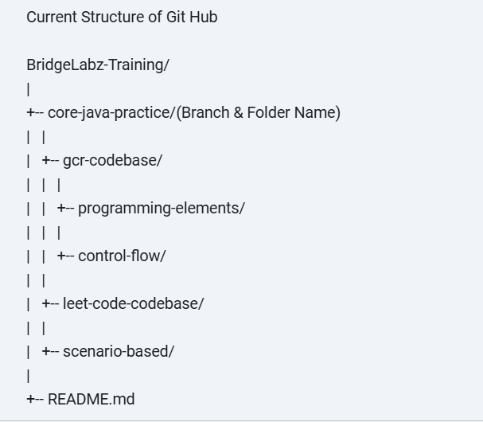

1. Week 1 : Getting Started with Java basics
     16-Dec-2025 (Tuesday) : Installed and set up java Solved and submitted basic practice problems and leetcode problems.
     [Leetcode](https://github.com/Muskann05/BridgeLabz-Training/tree/core-java-practice/core-java-practice/leet-code-codebase)

     17-Dec-2025 (Wednesday) : Studied the history and features of java. Solved elementary problems.
     [Programming-elements](https://github.com/Muskann05/BridgeLabz-Training/tree/core-java-practice/core-java-practice/gcr-codebase/programming-elements)

     18-Dec-2025 (Thursday) : Continued with documnetation. Practice Level 1 Elements problems and Completed and submitted Level 1 and Level 2 Problems on Elements.
     [Programming-elements](https://github.com/Muskann05/BridgeLabz-Training/tree/core-java-practice/core-java-practice/gcr-codebase/programming-elements)

     19-Dec-2025 (Friday) : Studied control flow documentation and  Solved and submitted control flow practice problems
     [Control flow](https://github.com/Muskann05/BridgeLabz-Training/tree/core-java-practice/core-java-practice/gcr-codebase/control-flow)

     20-Dec-2025 (Saturday) : Solved arrays and scenario based problems and submitted.
     [Arrays](https://github.com/Muskann05/BridgeLabz-Training/tree/core-java-practice/core-java-practice/gcr-codebase/arrays)
     and
     [Scenario based](https://github.com/Muskann05/BridgeLabz-Training/tree/core-java-practice/core-java-practice/scenario-based)

2. Week 2 : 
     22-Dec-2025 (Monday) :  Studied Strings and solved and submitted string practice problems Level 1, 2, 3 and solved one leetcode problem
     [Strings](https://github.com/Muskann05/BridgeLabz-Training/tree/core-java-practice/core-java-practice/gcr-codebase/strings)

     23-Dec-2025 (Tuesday) : Give the review in which AddOneToArray and some thoery questions has been asked.
     [Review](https://github.com/Muskann05/BridgeLabz-Training/blob/review/review/AddOneToArray.java)

     24-Dec-2025 (Wednesday) : Studied Methods and solved Level 1 , Level 2.

     25-Dec-2025 (Thursday) : Solved Level 3 of method problems and submitted.
     [Methods](https://github.com/Muskann05/BridgeLabz-Training/tree/core-java-practice/core-java-practice/gcr-codebase/methods)

     26-Dec-2025 (Friday) : Solved and submitted extra string problems.
     [Extras](https://github.com/Muskann05/BridgeLabz-Training/tree/core-java-practice/core-java-practice/gcr-codebase/extras)

     27-Dec-2025 (Saturday) : Solved and submitted leetcode problem.

