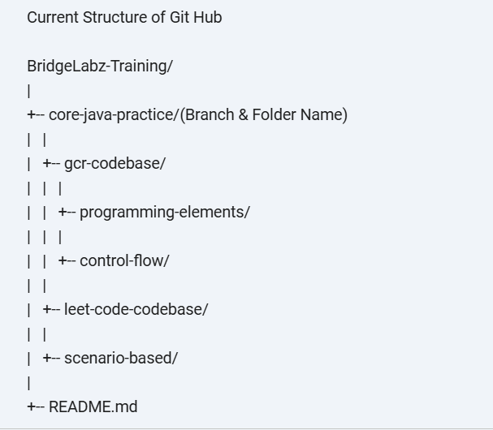

1. Week 1 : Getting Started with Java basics and make core-java-practice branch.

     16-Dec-2025 (Tuesday) : Installed and set up java Solved and submitted basic practice problems and leetcode problems.
     [Leetcode](https://github.com/Muskann05/BridgeLabz-Training/tree/core-java-practice/core-java-practice/leet-code-codebase)

     17-Dec-2025 (Wednesday) : Studied the history and features of java. Solved elementary problems.
     [Programming-elements](https://github.com/Muskann05/BridgeLabz-Training/tree/core-java-practice/core-java-practice/gcr-codebase/programming-elements)

     18-Dec-2025 (Thursday) : Continued with documnetation. Practice Level 1 Elements problems and Completed and submitted Level 1 and Level 2 Problems on Elements.
     [Programming-elements](https://github.com/Muskann05/BridgeLabz-Training/tree/core-java-practice/core-java-practice/gcr-codebase/programming-elements)

     19-Dec-2025 (Friday) : Studied control flow documentation and  Solved and submitted control flow practice problems
     [Control flow](https://github.com/Muskann05/BridgeLabz-Training/tree/core-java-practice/core-java-practice/gcr-codebase/control-flow)

     20-Dec-2025 (Saturday) : Solved arrays and scenario based problems and submitted.
     [Arrays](https://github.com/Muskann05/BridgeLabz-Training/tree/core-java-practice/core-java-practice/gcr-codebase/arrays)
     and
     [Scenario based](https://github.com/Muskann05/BridgeLabz-Training/tree/core-java-practice/core-java-practice/scenario-based)

2. Week 2 : Started With String and Scenario based problems.

     22-Dec-2025 (Monday) :  Studied Strings and solved and submitted string practice problems Level 1, 2, 3 and solved one leetcode problem
     [Strings](https://github.com/Muskann05/BridgeLabz-Training/tree/core-java-practice/core-java-practice/gcr-codebase/strings)

     23-Dec-2025 (Tuesday) : Give the review in which AddOneToArray and some thoery questions has been asked.
     [Review](https://github.com/Muskann05/BridgeLabz-Training/blob/review/review/AddOneToArray.java)

     24-Dec-2025 (Wednesday) : Studied Methods and solved Level 1 , Level 2.

     25-Dec-2025 (Thursday) : Solved Level 3 of method problems and submitted.
     [Methods](https://github.com/Muskann05/BridgeLabz-Training/tree/core-java-practice/core-java-practice/gcr-codebase/methods)

     26-Dec-2025 (Friday) : Solved and submitted extra string problems.
     [Extras](https://github.com/Muskann05/BridgeLabz-Training/tree/core-java-practice/core-java-practice/gcr-codebase/extras)

     27-Dec-2025 (Saturday) : Solved and submitted leetcode problem.[Leetcode](https://github.com/Muskann05/BridgeLabz-Training/tree/core-java-practice/core-java-practice/leet-code-codebase)

     28-12-2025 (Sunday) : Solved Scenario based problems and leetcode problem.[Scenario based](https://github.com/Muskann05/BridgeLabz-Training/tree/core-java-practice/core-java-practice/scenario-based)

3. Week 3 : Solved Scenario based and Started with object oriented programming.

     29-12-2025 (Monday) : Solved Scenario based problems and Employee wages problems and Submitted it.[Scenario based](https://github.com/Muskann05/BridgeLabz-Training/tree/core-java-practice/core-java-practice/scenario-based)

     30-12-2025 (Tuesday) : Solved and submitted Line comparison , Snake and Ladder scenario problems and read material of oops.[Line Comparison](https://github.com/Muskann05/BridgeLabz-Training/blob/core-java-practice/core-java-practice/scenario-based/LineComparison.java) and [Snake and Ladder](https://github.com/Muskann05/BridgeLabz-Training/blob/core-java-practice/core-java-practice/scenario-based/SnakeAndLadder.java)

     31-12-2025 (Wednesday) : Solved and submitted Java class and object problems and  also solved and submitted Constructors , access-modifiers and instance problems .[Class and Object](https://github.com/Muskann05/BridgeLabz-Training/tree/oops-practice/oops-practice/gcr-codebase/class-object) and [Constructors](https://github.com/Muskann05/BridgeLabz-Training/tree/oops-practice/oops-practice/gcr-codebase/constructors) and [Access-Modifiers](https://github.com/Muskann05/BridgeLabz-Training/tree/oops-practice/oops-practice/gcr-codebase/access-modifiers) and [Instance](https://github.com/Muskann05/BridgeLabz-Training/tree/oops-practice/oops-practice/gcr-codebase/instance)

     01-01-2026 (Thursday) :  Solved and submitted this-static-final keywords problems.[This-Static-Final](https://github.com/Muskann05/BridgeLabz-Training/tree/oops-practice/oops-practice/gcr-codebase/this-static-final)

     02-1-2026 (Friday) : Solved Scenario based problems and create object , class , sequence diagrams and submitted it.
     [Object-Class-Sequence Diagram](https://github.com/Muskann05/BridgeLabz-Training/tree/oops-practice/oops-practice/gcr-codebase/class-object-sequence-diagram)

     03-01-2026 (Saturday) : Solved and submitted Scenario based and inheritance problems.[Inheritance](https://github.com/Muskann05/BridgeLabz-Training/tree/oops-practice/oops-practice/gcr-codebase/inheritance)

     04-01-2026 (Sunday) : Solved and submitted Scenario based problems.

4. Week 4 : Read about oops-pillars and Started with Data Structures and Algorithms.

      05-01-2026 (Monday) : Solved and submitted Scenario based problems.[Scenario based](https://github.com/Muskann05/BridgeLabz-Training/tree/oops-practice/oops-practice/scenario-based)

      06-01-2026 (Tuesday) : Solved and submitted Encapsulation , polymorphism , interface and abstract classes problems.[oops-pillars](https://github.com/Muskann05/BridgeLabz-Training/tree/oops-practice/oops-practice/gcr-codebase/oops-pillars)

